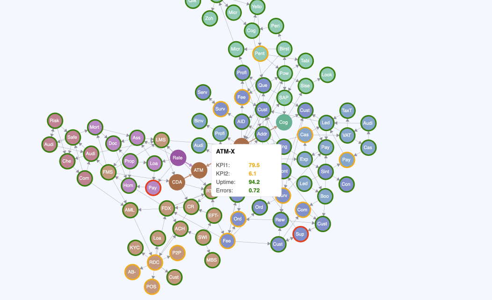

# observability-e2e-visualization

## Purpose

This project showcases how to leverage Elastic transforms to generate a directed graph visualization for enterprise asset autodiscovery. The intention is to enable automatic discovery of assets, typically managed in a Configuration Management Database (CMDB), by analyzing event data.
This repository provides also the tools to develop the Vega files.

## Solution Idea

The prerequisites to make this approach work are:
- every event has an `asset_id` which represents an entry in the CMDB
- every event has a `timestamp`
- there is a field (e.g. `session_id`) which has the same value for events which belong together
- the CMDB is synchronized to an Elastic index having `asset_id` as id and provides details about the asset: e.g. `service.name`, `domain`, ...
- (optional) there is a query which can provide status for an `asset_id` e.g. KPIs

The idea is to group the events by the `session_id` to get a list of assets which are sorted by `min(timestamp)`. Then to build pairs of neighbours, e.g. `[A,B,C,D]` → `[(A,B), (B,C), (C,D)]`. Then a directed graph can be created where assets are nodes and the pairs represent the directed edges.

## Features

### Main Components

#### elastic-scripts
This directory contains scripts for interacting with Elasticsearch. These scripts handle data indexing, querying, and transformation operations needed to prepare your data for visualization. They likely include functionality for connecting to Elasticsearch instances, creating and managing indices, and executing search queries.

#### input-data
This folder stores the raw data files that serve as inputs for your visualization pipeline. These could be JSON files, CSVs, or other data formats that are processed before visualization. This separation allows you to keep source data organized and versioned.

#### vega-specs
Contains Vega specification files that define your visualizations. These are declarative JSON files that describe how data should be visually encoded using the Vega grammar. These specifications define mappings between your data properties and visual elements like position, color, and size.

### Development Resources

#### vega-viewer
A custom viewer application that renders the Vega specifications with your data. This likely provides a development environment where you can preview your visualizations, adjust parameters, and test interactions before deploying them to production.

#### tools
Utility scripts and helper applications to support the development workflow. This may include data transformation tools, specification validators, testing utilities, or build scripts that streamline your development process.

#### doc
Documentation files detailing how to use the project, API references, examples, and implementation details. This helps ensure that all team members understand how the system works and how to contribute effectively.

### Visualization Output

The project generates a sophisticated network visualization with the following characteristics:

#### Directed Graph with Force Layout
- Uses a physics-based force simulation to position nodes and links dynamically
- Nodes represent entities in your data while edges show relationships between them
- Force layout automatically arranges elements to minimize edge crossings and optimize readability
- Interactive capabilities allow users to drag nodes, zoom, and explore the network structure

#### Status-Based Visual Encoding
- Nodes feature colored borders that encode status information
- Color mapping provides immediate visual indication of different states or categories
- Consistent color scheme helps users quickly identify patterns and anomalies in the data

#### Rich Interactive Tooltips
- Contextual tooltips appear on hover/selection to provide detailed information
- Structured as key/value pairs with associated color indicators
- Enables exploration of additional data dimensions without cluttering the main visualization
- Helps users understand specific attributes of nodes without losing context of the overall graph



Or try it in Online Vega Editor: [Open the Chart in the Vega Editor](https://vega.github.io/editor/#/url/vega/N4IgJAzgxgFgpgWwIYgFwhgF0wBwqgegIDc4BzJAOjIEtMYBXAI0poHsDp5kTykSArJQBWENgDsQAGhAATONABONHJnaT0AUQA2SCGqgACTQCZNh4jTgB3aSGs1Z9NAEYALAAYPM+DTJY0AA4vGRwkWVkacTI0UG04ADNMNG8QZX9k1FTMNhwUmSY2bDYEFIBfGSQGHIgaAC84NBAw2TsmJCgAazJFNgZxVvQAYgS3BIB2BIS7WSRMFFQAbVBxJARG9G0ozoBaWfmdxSRbGQZFbSasXHwiI+tqOkYmBgg4RSgJTDhxTEoPhAIcF0+hoUAIbCYr0UxCQTBoW0wAE8dnATHAdpYIAwkFs6nN1ARFIkIAR4OEScgogR9lRRBI7Ak2IpkJlQEicBsQHTJKFehzFEimltxJ0ICAyhUVmtOcLdjS7GIzlAZds9nMkIdjuKpFL1k1Fe90R9xOI4FA1BIxTIDcqhaqaZqTiBMEdxBBGcy0MtnYiOU0kGQenwvnYen0cExEV6QDbGgBdGS5MVLEAw7QMBQgBMgBJWbSyZOLZ1IRRkODJbN6aPG03m9RiuOSn1+9AehAMXR2Kvoeal8tWkBwAAeOEUTRw6a6AAp9gwEH8JLWLW6pIYAOS9suYNcASnFjZ1IFWep7Ja3OxrZuXA9jdpFaoOdzsLqQbrbXrZvs5AaDFBDMjDBgIyjFNN3LLNEzwaM0wzBsZFzIEC2jW9K0LEBLzrS0sybdlOTbDsUEqZMYz6Q0B2HUdx0nToZzmOcFxNK961XNdY13fcm2PTlxDYeQH0IkAzgudArjwQhCWOB56GYF43mNL4fgXAEgT0AxwUhN4YThBFkVRdFMWxXF8QkQliVJOByQISlxGpdURDEHkcyZFlYmbTluTsUdcjeQV0B4+QxQqZ1XXdZyPzcoU2DYTogIZXpSnQWML0XJisJkTo4BAkilUaeC8yQlMuIg1McVg6MwMwOCQG7IsKqq+QEiqbRMiLbDD1wyLoti+D4qaCrksYzC3TsDKsoqhl8rQorsxgzMU1jKqauysjioapqWpANrPxbJzDTsOg3mM4bUAAZhCNIFF7VkYz8VZhIu-QS2SILajIO6mg9W14KZZVC1AT7OWVH43jsIdXNe970CgMGgpA0AIZxJooCjCVDwBpG2G0LZ5DsI5IhecHbsRxKAEcBSnNxDAAKkMfy4AAJXCGgXmp2neIZpmXj3IKDqOa9XGtF1vjIZwskocYm3RvzClkKNBaJaJRfhon7rpgBhGAz0aVH-p+lURTsWViNlfjHRmGhHvEW1UGVt7iZAWUABELfmK3tZkRwmiKsoD22vDnIIrtiISMGZAosdWxoIdFg8OMAEIAF5xA7bRDAAMjTtn5AThPZ3nKJ5CHQwAH4olIcm1yHaAcTgNcpFzaPY53VBk6x7U-Y+gPOyIj65cHEcI5zKPFhceOk5T9PM7pnO89YAZhxLsufKnNdEWr+I64bke42b1uLh9zjpT6qLmpUPZyyQeEb1I62j3Z-jnxC98lg7yPmpBsOB699mAAk2HLygdNJ6GFngXBeOcE5ZzgH-ABnscJfg+robA3wJqITQvIeYV9ipLQwZfC4vsIroAcAMNgTokzRl6NYAA+snBATAQaoWjLg+EVCwFgwIR1VsXcBLdjkBfFho07DhyaLPZh2hKCCPgTtfC3dqrETEVQ2aQiv7oFEfw8RSipH+2ZIHHuqj1FUI+NoJkyjKKqLovOMRC5jFjgPtmBG2g-pHiPugIcroyx2CAvsTkMdVwOCcDAOM7dnEnhAIidxuVBI4G8U0RYvgMirljsEoqrjhzJFONEuYPjvCGH8fQIJh9QmIjSZ4zJIZ0BxLgH4LAiSCmHhSXIUhjklEtxTomDQ3o4CkB+MRBAfRXhASkDkBgsBvitAyTEvyKdgldO+JVJofTZKyCaauYZsBHoClKZMkAQ5ERTm5oeWZPT9SIjoZjVAizXjLOsOIVcEBTmFG0KgNZMANnpKidsveHF6kuJ2VAM4dgWl73aeFI58z0CXLgNc25hgXlvNWX0UZAwtlZKaEOZZpQD4-KKf8scMggVtJAPSF+g5ungpAJC6FCKRmvKutSpF4yPmovQIiDF3zdScnkM1ASLTfGxxBSSsFTjbxEILqQ58CCIX9MQP-SJxosQnhdBmAo5ZrBwBQSSzhFLpXQuCSK+wYqnRashbFLFr9nSIpgH00gdh5Vzg2EquAeV36DzBZQF5ChKDxEVjAQwEDDAuH3BM5ljSbkl0MIsaFMc4w7CHPs1ceydx7CadvOMhhUARu8Eks1ITvxWxgCY-FpUNh8uzMSzpZLiLWHgECFF5SQCLCXhXKuUAa510MHGncO5VxNswCvNeraN4Jv2TuOpoAhWuS1XCq6E0XVNDdR6iAXrhb0AgSYbUTL62LCnOiko0bDAAGoO0Yu3juQwBBDAmFXFOVle7Y6HsMLehAp7z2XoKQQhpdQoqlCLemDYLgBUVrmVWmt2g44Mj1mgR1wb604FIVOFwlAvAAcMG6rl8wACarM4PWAQwANlXGhoE8wACy7Mu0zMrYTO291Ij6HXUFKW0HN2cpdi4V9dHMAMcOVRkl+rLA2AlTtWQTBtBQC2F0INLGmiBpzQ0zjgbf0ZnyESjp47ePmunU9WdXxXVkvdZaz13qRYwDXRurxIacBRFgM7S2yopxgoOep4D1HIZyBdtx6TqiPPstzSInzSmNipHLc545NtCEWppdauVlp7VQcUMqoec70ALsM0u4zq6c6eYs7B6zMBbOu3s453zDTd0-q8zskpgHQvgttm59DKAgo5Z8UOXF+6j0QDCOIHduKz00wa-ui9eSYCrla2cbeD7Ouvh62cPrIDiNIEG7kxw+TKMufCw4poX6SjmbKT418sAmTtcMDuk996diGAOwWxQ0a5vbYQKuK7R371HtO3u0ehgLtPZu03Vm92x2kvW96fjVgjWSrkKJ8ToJOhSea2iiJJXflPrrZyYpQ53khcB2Fur9sGu7e2YsREbWXuGCm91ons3WYDY+xe+JNTH1tY+x1rrN7etU4WxN2nVSMgA4nRtlWW3v345DYsb7E3XtPv3V9-NR3R53e-Y9mXN2mcnclx96Xh3lc7z+9+3nvHgc305AJsHwnIcSZhz7GDqOEdyd+bUBoKOka6AQDgKcJgPCvrJ29hA3aA2rhcF4DwTm-NQ1DhV4br713Vax+SxY9yzlPMpSs5bJDrAXOlUBNNAA+FP1z0+yWi479AhhoY52GwQEwxdoYHo8EhjwLhUDl4Yx+35yMi8YG51gSPyTfl00ZvjCAABpTKMwFBQGUKodQTQSYJ2s0SPQcBSf1CdZd3OZp5+vCXw7wLQRo984Nan1Ao1RwKAHHDlL+nRo5zXEgNcGc++cyH5lLPLhi4P4H8P5EDe3VX4TmuEma4b+7M-ezMT+iIB6De7+oBn+iOoSUBBMO+qALgBGIAcIyK4WUQOA1QTQCOMgCAUQAsFKSAYMqAAgqQ+gcAeQSBQUmOfOOOqswBj+MBTWe2388gIBLwzBLecB7MGsWsgKxaaAOwZ0BQBcrkmB2B6AuBFKBBqAOwAeqQyAJBAegslBrgOsIeDs2wBWB2kSLSIhqBYhGB4gWBmQaQr4HieBshAgeBxBaAZ05BXwVBLgGhAU4+Kgy4TQAAyvMF8BYCWDQLCPEIYB6JdnWKQFAiEVHKTr4S8JQHYA0g3AIX+mgI1I4k6qpqCrxjGA8ucpCn0JgIsHHG6s8MUG6AmLnqQvngMnkFbh9DiK8GtmFjkQntUXALKnihVg3IYAAD49GwoJaRJMaDFNj75x65GJ46rJ7EJ54mo4DZ6VFp6QrRbgZ1GuKJoQZ7TPIjEEJuET6eHoAADiRwOAvqQCfS+ghgRIQMmA2giIhgUQumHQXwsgy29A8RMgDSdMyRymrSWMe+2R8ejybRHR7e3R-qjq4aoC88RcGa3xtuPB8gMCH8JUKRGBgwwK6EKUQ0hY2Y3xfx2gNBamMexEQJeR0qoJaxIAwAa4jga4qA0JhcLEGE149JnWCItEmA9EC0B6dca4B6s8dUUgfJvua4dM9JecZQTR5KZJkxskBR7eNJdJBJzJ2JrJSwFRYp7M9Je8UpOaexHhU+6AAAYroGQLCmwFcZdE9IYMaXrEvu2EguoIYEBBICAuqCXprNEJ6gkb8kSG8j8RsGka8ACetvQR9FHMLvWt0RnFEUOMuj6hxPYoOnNN6A0kYoWhFkyJEO9DIBipfBoKAPKH5PfPKHlIhE0IBHkEFAjimEMG4HhoECYEwG4HYPWXhh2S2W2Q2S2QAJytkyBDAtl4bjANltktkNl4ZR4gBDBIBuBjBIAnRbSaEto1x2ANC9CpENEZH5myHhmuJso1kWEbD7k7I26FKo7ryRIblsBbnpF5klAFmub2zI5HnenPn3ThLHniiW5EGKCijhRaphDOCfG-JGxxQ7bhbFlaH3jyg8zAxHDhFBnblhxWzsyuTn7wwujRQnk3Q0YiIWKUCxhzyFyJx0zImKCsCvGxmClay-BsJkW-wdFUXhprhDC9kmC9knS9m9n0nrB9hTivLaBThXkrwZmKDtqzzEVVldqrjABPK154ZuBlAHIxjYUZQADqK2MAH5BFXJ84xFDFScTFsC1FmctFfY9FMJjFSJzFjg4ateAgqADGqMwUr4oUnomq4OsowFOlMgRIJMDANARIulXCe0L0msO0wokSsYAAGq5MIolCmSvKuUOu6fpZQFJYbpQEOKpbGBhglSojGMlavFeZJYRVlTlJQIiKpRVPFeFolcVTXClWVauKIoRRVDlbVXRQVQ1UVaJaVSmeVRlRZVuNVdzFop3DorIo1eqOICYJyfRKNeWNVZ9ulUtYRcRYiFIO1RlcRUXBdrtfRJ1blUHP6NEPELJu1ODjIgJI1YtfOBYZdVngnB4MXLPE9XAA3m7lTAAAoACSD6H1F1X1XarMU4J0eGHuF6P1ANFGei1UIN3G5qt1pig8ENUND49En1JgO4VMU4ANBALgwQe4CNn1S5k1YVjpd1RVU4HwEAD1lA5NeNU48BEAB6AgXaB6IlJVqVtcO1FVHVdFXVpNci-oiglC8VlNu01NaNTQIlUQjNzN+NbNHNXNPNzVg1baAtI1Qtll41otvCJYlCBVOaWqspvpoSxtpCA4dQbChBCQvUUF6od4AFQU3wHwOM4WmFMYkVuFLSwUgRING6n1oVIAWNj1SNOwvZHgG6JBp5H1EtpCUtMgcMeF9WhF1t1gptMgXw6OYda4gATaRrgbq5htz874XmK617XZVGXkV2VmXrWWJ61jV10mVvAsXFzrjsWcXcW8UXJvBliCUQDCUDXiXDUbU11VUyW+7yVixKUqUbr264WbYlnsGP45yv4eCoBQ0-kaFfHswDjm0THrn21IE9SQVFku1r3ohwWoWe24U+25AdB0Bp0tIuHOrCSnn12mUQKMkLx9EPEwlsAJCs3t2UUsnMRN2ALSg7hZ7yElxj2YxMgT3zgyUD0CVCUa3xBiXIMSVtWEUz1yUKWUAL15XqUr0C430UVUV-2EVsK9H9FsIgNgO2UAKQOWgEMZVcRwMINd1IM2KoPUC9BARnoZqM2FCKDyCKBqx4NQmEWSPSOyM2LpqGD8VD1YMCMoNcP0REOGBz214SwUYvQUNaUBKuT6EmO9AZQADyYQUAr9Fjgh1B1oy+YdlMNMbNrMbNG6uKYgEcoAAdcGjxIMQU8d6d9sW8scZFE8sZ08M89DMJJcUTcYqAA1fNQjp1sMYdW8o8MTWMwC8TuciThcyTw8o8aTJVA62t0DNVP5PgoJNsEo0ted7yDSug9CjiEFCUV98wbBmYQUdtMJaAV6IAITiFagNqqAwZGRcyIMTT996F3trB4WZdX9ET90a41aB0Jd2Tqz+UTQKMMg4TCE+YaKG6rTrkpzgwcghF3slQWwb0TjaJ6Eczti30PwXhbj4W79HgQU7Qrw0VzzvxMhEQ8QG6Ww+B10q96EzuruEAZMfaHjUCHBEA3jjBA+Sa4wUgAGChQeG6QIWweAFswLnIhge90tVZltnIOQmMagtRYzCFzxNAUzMzMgQzhcaANhg4aFXtoAPt4TMLP9HdQC-DvNrVUCNDdMXVk2iLFM6L69A+CrHMmLkeD6Aeqjsdez394DgC7M4aA11TaVwrlF0rNVa1FMHur2Jrer8gmV6iaLXdxNrMGWMArD0CzF0rYiEAYjhgQeZ6F6JgmrG6w2pLrgZBQUdO0LVDIAngD67rUr+rcTurXrDr4azrNMrrCbnr7M9rmCjivr+LNB9jjjFdbmNr9lictME8TrwbjG8I6zAd2zIYVjOFYbwwUAnbS9pj2l7bjlQUHwigpoigqL7bAgzTth-5TiU6VWPLD9GFKzoA4Tvz2rqJvx7uQUlzZb9sNrorkrObdrXEqja4uzn97bM5Lgl7pdnwGlne10AdjyrQjGnwXzDuPzzjLgJ0zTLTs7jtl9tzfTPYJ89L58+bgUizfLXmS77bAeq7MLcbR6GbJ2ai+brCSTF2LgtVJS27tGFVBio0D69Jp7SWjbzjM5AgFH17nz3zgTH7JgQUOIt0578QSQG6ALQIUQ-tZHOQ1ZE7mmv7TtvTCwFqdLZ83rBLvLj9i7Oy7bwQcHMbCHAagQ4NKHeCaHpTGHWH+d+zFZ+iqHmiZ7OnZzenan4lVHmAr7XHaJLg9HHzmAt71S97ZHj7IdjzhZa7MoiQz0BQC+QL77LzPHFLHC4OlzeZ19ywv5HtSz-L0nW7tHaJRYOgqkoIbU1UbnzHXnELnHP8d7MHeG9b5d8XILQwAgvZpXpXcdYdEeGHXgG6adMLUbD67uWrdnlnMHfzzTjYQAA)

## Usage

## Limitations of Vega Scripting in Kibana

Kibana's Vega integration is powerful but comes with important limitations:

- **Single-file scripts:** Kibana only supports a single Vega (or Vega-Lite) specification per visualization. There is no support for importing or composing multiple files or components.
- **No reusable components:** Unlike some visualization frameworks, Vega in Kibana does not support modularization or reusable components. All logic, data transforms, and visual encodings must be defined in one file.
- **No external script execution:** You cannot use JavaScript or external code for data transformation; all data manipulation must be done using Vega's built-in transforms.

### Approach for Reusability

To make this visualization script as reusable as possible within Kibana's constraints:

- **Elastic Query Integration:** The Vega script should include an ElasticSearch query to fetch the relevant data directly from your cluster.
- **In-script Data Transformation:** Use Vega's `transform` blocks to reshape the query results into the node structure described in the `data.json` documentation above. This means mapping your ElasticSearch data to an array of nodes, each with `name`, `group`, `details`, and `borderColor` fields.
- **Self-contained Specification:** All logic for data fetching, transformation, and visualization must be contained in the single Vega spec file (e.g., `directed-graph-tooltip.vg.json`).

**Summary:**
- The script must be adapted for Kibana by embedding the ElasticSearch query and transforming the results to match the expected node structure, as described above. This enables the visualization to be reused with different data sources, as long as the transform produces the required structure.


### Development

#### Getting Started

1. **Clone the repository:**
	```bash
	git clone https://github.com/elastic/observability-e2e-visualization.git
	cd observability-e2e-visualization
	```

2. **Install dependencies:**
	```bash
	npm install
	```

3. **Start the Vega Viewer:**
	```bash
	npm run vega-viewer
	```
	Then open [http://localhost:3000/](http://localhost:3000/) in your browser or within VS Code.

#### Vega Viewer Features

The custom Vega Viewer provides a local development environment for previewing and interacting with your Vega specifications and data. Key features include:
- Live reloading of specs and data files
- Interactive exploration of graph visualizations
- Support for debugging and rapid prototyping

#### Recommended Development Workflow

- Use GitHub Copilot or a similar agentic coding assistant to accelerate development. These tools can access your code, data, terminal, and even the internal browser for a seamless workflow.
- Make incremental changes to your Vega specs and supporting scripts, using the Vega Viewer to validate and refine your visualizations in real time.
- Before committing changes to Vega spec files, ensure they are formatted for readability and consistency:
  ```bash
  npm run format:json
  ```
  This will format all Vega scripts to a readable and standardized JSON structure.

#### Additional Tips

- Keep your data and spec files under version control for reproducibility.
- Document any custom scripts or workflows in the appropriate `tools` or `doc` folders.
- Use the provided mock data and responses for local development and testing.